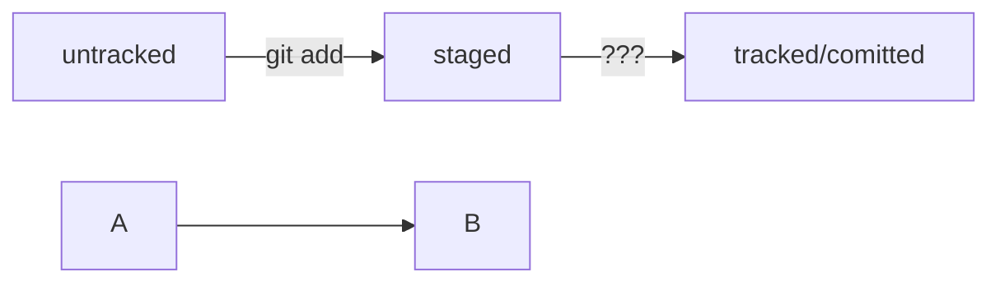

HEAD -- это голова.
Коммит -- это всему голова.
Статусы файлов:
<тут пустая строка!>

```mermaid
graph LR;
  untracked -- "git add" --> staged;
  staged    -- "???"     --> tracked/comitted;

%% стрелка без текста для примера: 
  A --> B;
``` 